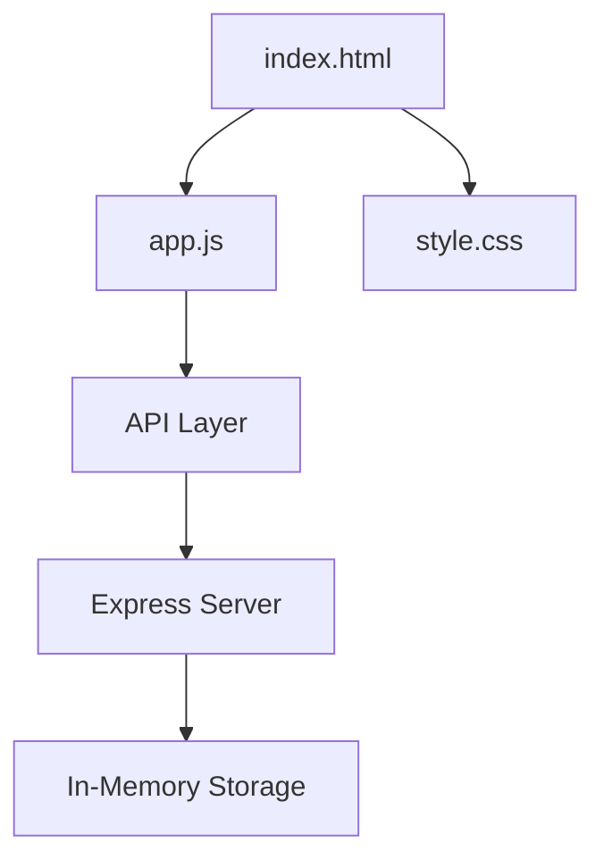
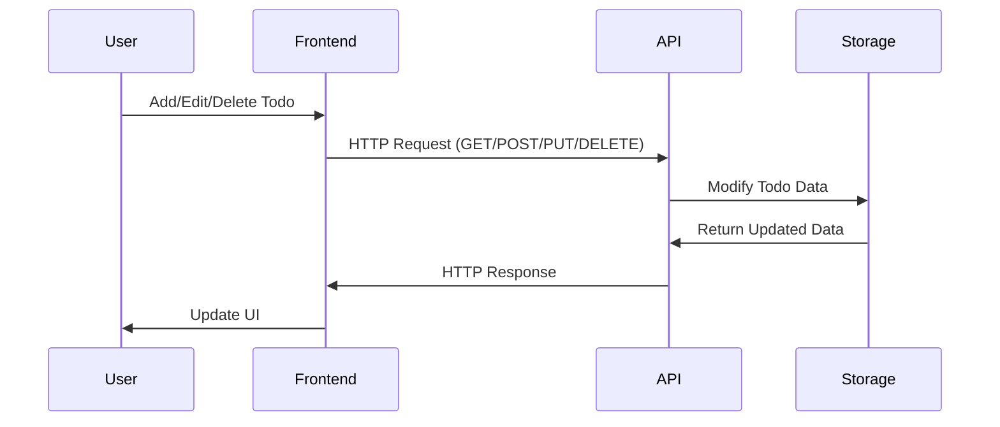

# Todo List Application Documentation

## Architecture Overview

This is a simple todo list application built with a Node.js/Express backend and vanilla JavaScript frontend.

### Component Hierarchy



### Application Flow



## Features

1. **Add Todo Items**: Users can add new todo items through a form
2. **Toggle Completion**: Click on a todo item to toggle its completion status
3. **Delete Items**: Remove todo items using the delete button
4. **Persistent Display**: All todos are displayed in a list format

## Technical Details

### Frontend (`app.js`)
- Uses vanilla JavaScript
- Makes API calls using the Fetch API
- Manages UI state and updates
- Handles user interactions

### Backend (`server.js`)
- Express.js server
- RESTful API endpoints:
  - GET `/api/todos`: Retrieve all todos
  - POST `/api/todos`: Create new todo
  - PUT `/api/todos/:id`: Toggle todo completion
  - DELETE `/api/todos/:id`: Remove a todo

### Data Structure
```javascript
{
    id: number,      // Timestamp-based unique identifier
    text: string,    // Todo item text
    completed: boolean // Completion status
}
```

## API Endpoints Details

### GET /api/todos
- Returns: Array of all todos
- Status: 200 OK

### POST /api/todos
- Body: `{ text: string }`
- Returns: Created todo object
- Status: 201 Created

### PUT /api/todos/:id
- Returns: Updated todo object
- Status: 200 OK or 404 Not Found

### DELETE /api/todos/:id
- Returns: Empty response
- Status: 204 No Content or 404 Not Found

## UI/UX Features
- Clean, minimalist design
- Responsive layout
- Visual feedback for actions
- Clear completion status indication

## Architectural Patterns & Design Principles

### Design Patterns Implemented

1. **Module Pattern**
   ```mermaid
   graph TD
       A[app.js Module] --> B[API Functions]
       A --> C[Event Handlers]
       A --> D[UI Functions]
       B --> B1[loadTodos]
       B --> B2[addTodo_text]
       B --> B3[deleteTodo_id]
       B --> B4[toggleTodo_id]
       C --> C1[todoForm.addEventListener]
       C --> C2[deleteButton.onclick]
       C --> C3[textSpan.onclick]
       D --> D1[renderTodos_todos]
   ```

2. **Event-Driven Architecture**
   ```mermaid
   sequenceDiagram
       participant User
       participant Form as todoForm
       participant Handler as submit handler
       participant API as addTodo
       participant UI as renderTodos

       User->>Form: Enter Text & Submit
       Form->>Handler: e.preventDefault
       Handler->>API: addTodo_text
       API->>Handler: Response
       Handler->>UI: loadTodos
       UI->>User: Display Updated List
   ```

3. **Async/Await Pattern**
   ```mermaid
   graph TD
       A[API Call: loadTodos] -->|async| B[fetch('/api/todos')]
       B -->|await| C[Response]
       C -->|success| D[renderTodos_todos]
       C -->|error| E[console.error]
   ```

4. **MVC-like Structure**
   ```mermaid
   graph TD
       subgraph Model[Model Layer]
           A[todos Array]
           B1[loadTodos]
           B2[addTodo]
           B3[deleteTodo]
           B4[toggleTodo]
       end
       subgraph View[View Layer]
           C[renderTodos]
           D[DOM Updates]
           D1[createElements]
           D2[updateClasses]
       end
       subgraph Controller[Controller Layer]
           E1[form.addEventListener]
           E2[deleteButton.onclick]
           E3[textSpan.onclick]
       end
       E1 -->|Trigger| B2
       E2 -->|Trigger| B3
       E3 -->|Trigger| B4
       B1 -->|Update| A
       A -->|Data| C
       C -->|Render| D
   ```

5. **Observer Pattern**
   ```mermaid
   graph TD
       A[API Actions] -->|Trigger| B[State Change]
       B -->|Notify| C[loadTodos]
       C -->|Update| D[renderTodos]
       style A fill:#f9f,stroke:#333,stroke-width:2px
       style B fill:#bbf,stroke:#333,stroke-width:2px
       style C fill:#bfb,stroke:#333,stroke-width:2px
       style D fill:#fbb,stroke:#333,stroke-width:2px
   ```

6. **Facade Pattern**
   ```mermaid
   graph TD
       subgraph Simple API Interface
           A1[addTodo]
           A2[deleteTodo]
           A3[toggleTodo]
           A4[loadTodos]
       end
       subgraph Complex Operations
           B[fetch API]
           C[Error Handling]
           D[State Management]
       end
       A1 & A2 & A3 & A4 -->|Uses| B
       A1 & A2 & A3 & A4 -->|Implements| C
       A1 & A2 & A3 & A4 -->|Manages| D
   ```

7. **Separation of Concerns**
   ```mermaid
   graph TB
       subgraph Presentation Layer
           A[index.html]
           B[style.css]
           C[renderTodos]
       end
       subgraph Business Logic
           D[form.addEventListener]
           E[addTodo/deleteTodo/toggleTodo]
           F[todos Array Management]
       end
       subgraph Data Layer
           G[fetch API Calls]
           H[try/catch Blocks]
           I[Response Handling]
       end
       Presentation Layer --> Business Logic
       Business Logic --> Data Layer
   ```

### Design Principles Deep Dive

1. **DRY (Don't Repeat Yourself)**
   ```javascript
   // Reusable error handling
   function handleAPIError(error, operation) {
       console.error(`Error ${operation}:`, error);
       // Could be extended for different error types
   }

   // Used consistently across API calls
   async function addTodo(text) {
       try {
           // API call
       } catch (error) {
           handleAPIError(error, 'adding todo');
       }
   }
   ```

2. **Single Responsibility**
   ```javascript
   // Each function does one thing well
   function createTodoElement(todo) {
       const li = document.createElement('li');
       li.className = `todo-item ${todo.completed ? 'completed' : ''}`;
       return li;
   }

   function attachTodoHandlers(todoElement, todo) {
       todoElement.onclick =  => toggleTodo(todo.id);
   }

   function renderTodo(todo) {
       const element = createTodoElement(todo);
       attachTodoHandlers(element, todo);
       return element;
   }
   ```

3. **Error Handling Strategy**
   ```javascript
   // Consistent error handling pattern
   async function makeAPICall(endpoint, options) {
       try {
           const response = await fetch(endpoint, options);
           if (!response.ok) {
               throw new Error(`HTTP error! status: ${response.status}`);
           }
           return await response.json;
       } catch (error) {
           handleAPIError(error);
           throw error; // Allow caller to handle if needed
       }
   }

   // Usage in API calls
   async function getTodos {
       return makeAPICall(`${API_URL}/todos`);
   }
   ```

4. **Progressive Enhancement Examples**
   ```html
   <!-- Basic structure works without JS -->
   <form id="todo-form">
       <input type="text" required>
       <button type="submit">Add</button>
   </form>

   <!-- Enhanced with JavaScript -->
   <script>
   todoForm.addEventListener('submit', async (e) => {
       e.preventDefault;
       // Enhanced functionality
   });
   </script>

   <!-- Progressive CSS -->
   <style>
   .todo-item {
       /* Basic styling */
       padding: 10px;
       
       /* Enhanced with transitions */
       transition: opacity 0.3s;
   }
   
   @supports (display: grid) {
       /* Modern layout enhancements */
       .container {
           display: grid;
           grid-template-columns: repeat(auto-fit, minmax(200px, 1fr));
       }
   }
   </style>
   ```
