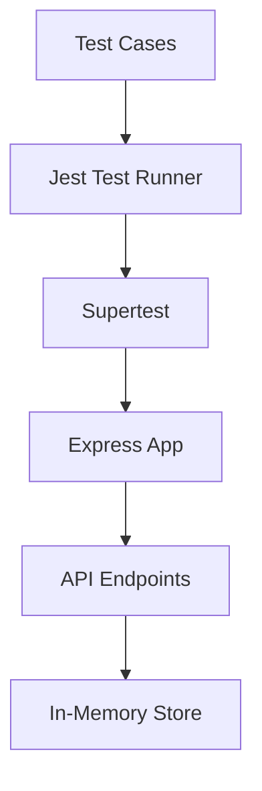
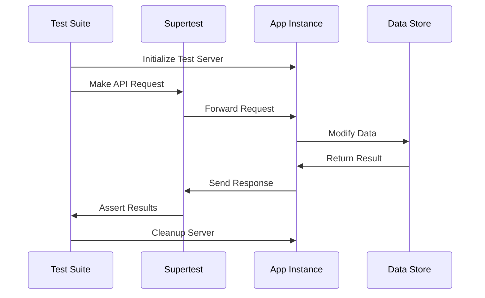

# Testing Documentation

## Testing Architecture



## Test Execution Flow



## Testing Strategy

### Test Setup
- Uses Jest as the test runner
- Supertest for HTTP assertions
- Separate test port (3001)
- Isolated test environment
- Automatic server cleanup
- **Docker-Independent**: Tests run directly against the Express app, no need to start Docker container
- Tests create their own server instance on port 3001, separate from the main application

### Testing Approaches
While the application can be tested using Jest alone, we use Jest + Supertest because:
1. Supertest is specifically designed for testing HTTP servers
2. It provides a cleaner API for making HTTP requests
3. Tests are more realistic as they test the actual HTTP layer
4. The tests better represent how your API will be used in production

Testing with Jest alone would require:
- Mocking HTTP requests
- Testing route handlers directly
- More complex request/response mocking
- Less realistic testing scenarios

### Test Categories

1. **Integration Tests**
   - API endpoint functionality
   - Request/Response handling
   - Data persistence verification
   - Error handling scenarios

2. **HTTP Status Codes**
   - 200: Successful operations
   - 201: Resource creation
   - 204: Successful deletion
   - 404: Resource not found

### Test Cases Overview

1. **GET /api/todos**
   - Returns empty array initially
   - Returns correct todo list
   - Validates array response

2. **POST /api/todos**
   - Creates new todo
   - Validates todo structure
   - Checks response status
   - Verifies data persistence

3. **PUT /api/todos/:id**
   - Toggles todo completion
   - Handles non-existent todos
   - Validates state changes
   - Verifies response format

4. **DELETE /api/todos/:id**
   - Removes todo items
   - Handles non-existent items
   - Confirms deletion status
   - Validates data removal

## Running Tests

### Commands
```bash
# Run all tests
npm test

# Run tests with coverage
npm test -- --coverage

# Run specific test file
npm test -- server.test.js
```

### Understanding --detectOpenHandles
The `--detectOpenHandles` flag is used to detect and report resources that weren't properly closed after test completion. This is particularly important for:
- Server connections that remain open
- Database connections that weren't closed
- File handles that weren't released
- Event listeners that weren't removed

In our todo application, we use this flag because we're working with an Express server that needs to be properly closed after tests. Without proper cleanup:
- The Node.js process might hang
- Port 3001 might remain in use
- Memory leaks could occur

This is why our `server.test.js` includes the cleanup code:
```javascript
afterAll((done) => {
    server.close(done);
});
```

### Test Output Example
```
PASS ./server.test.js
  Todo API
    ✓ GET /api/todos should return all todos
    ✓ POST /api/todos should create a new todo
    ✓ PUT /api/todos/:id should toggle todo completion
    ✓ DELETE /api/todos/:id should delete a todo
    ✓ PUT /api/todos/:id should return 404 for non-existent todo
    ✓ DELETE /api/todos/:id should return 404 for non-existent todo
```

## Best Practices Implemented

1. **Test Isolation**
   - Separate test port
   - Clean server shutdown
   - Independent test cases

2. **Error Handling**
   - Non-existent resource tests
   - Invalid request handling
   - Error response validation

3. **Async Testing**
   - Proper async/await usage
   - Request timeout handling
   - Clean async cleanup

4. **Code Coverage**
   - API endpoint coverage
   - Error scenario coverage
   - Response validation

## Troubleshooting Tests

### Common Issues
1. **Port Conflicts**
   - Ensure port 3001 is free
   - Check for zombie processes
   - Verify server cleanup

2. **Async Timing**
   - Use proper async/await
   - Handle test timeouts
   - Verify cleanup hooks

3. **Server Cleanup**
   - Check afterAll hooks
   - Verify server.close()
   - Monitor process list

## Hello World Examples

### Basic Jest Test
```javascript
// hello.js - This is our source file containing the function we want to test
/**
 * A simple function that creates a greeting message
 * @param {string} name - The name to include in the greeting
 * @returns {string} - The complete greeting message
 */
function sayHello(name) {
    return `Hello, ${name}!`;
}
// Export the function so it can be imported in our test file
module.exports = sayHello;

// hello.test.js - This is our test file
// Import the function we want to test
const sayHello = require('./hello');

/**
 * test() is Jest's function for creating a test case
 * First argument: description of what we're testing
 * Second argument: the actual test function
 */
test('should say hello to someone', () => {
    // Arrange: Set up our test data
    const testName = 'John';
    const expectedOutput = 'Hello, John!';

    // Act: Call the function we're testing
    const result = sayHello(testName);

    // Assert: Check if the result matches what we expect
    // expect() creates an assertion object
    // toBe() is a matcher that checks for exact equality
    expect(result).toBe(expectedOutput);
});
```

### Basic Supertest Example
```javascript
// simple-server.js - This is our Express server file
const express = require('express');
// Create a new Express application
const app = express();

/**
 * Define a simple GET endpoint at /hello
 * req: The incoming request object
 * res: The response object we use to send back data
 */
app.get('/hello', (req, res) => {
    // Send back a JSON response with a message
    res.json({ message: 'Hello, World!' });
});

// Export the app for testing
module.exports = app;

// simple-server.test.js - This is our test file for the API
// Import required testing libraries
const request = require('supertest');  // Supertest for HTTP assertions
const app = require('./simple-server'); // Import our Express app

/**
 * describe() groups related tests together
 * First argument: description of the test suite
 * Second argument: function containing our tests
 */
describe('Hello World API', () => {
    /**
     * test() defines an individual test case
     * We mark it as async because we're making HTTP requests
     */
    test('GET /hello should return hello message', async () => {
        // Arrange & Act: Make a GET request to our endpoint
        // request(app) creates a test HTTP client
        // .get('/hello') sends a GET request to /hello
        const response = await request(app)
            .get('/hello');
        
        // Assert: Check the response
        // Check if status code is 200 (OK)
        expect(response.statusCode).toBe(200);
        
        // Check if response body matches our expected JSON
        // toEqual() is used for deep equality of objects
        expect(response.body).toEqual({ 
            message: 'Hello, World!' 
        });
    });
});
```

### Key Concepts Explained
1. **Jest Basics**
   - `test(description, testFn)`: Creates a test case
     * description: What you're testing
     * testFn: The actual test code
   - `expect(value)`: Creates assertions about a value
   - `toBe(expected)`: Checks for exact equality (like ===)
   - `describe(name, fn)`: Groups related tests together

2. **Supertest Basics**
   - `request(app)`: Creates HTTP client for testing
   - `.get()/.post()`: HTTP methods to test endpoints
   - `async/await`: Handles asynchronous API calls
   - Response assertions:
     * `response.statusCode`: HTTP status
     * `response.body`: Response data
     * `response.headers`: HTTP headers

3. **Testing Best Practices**
   - Follow AAA pattern: Arrange, Act, Assert
   - Use descriptive test names
   - Test one thing per test case
   - Handle async operations properly

### Running Hello World Examples
```bash
# Create the files and run specific test
npm test hello.test.js

# Watch mode: Automatically run tests when files change
npm test -- --watch

# Run with verbose output to see more details
npm test -- --verbose
```