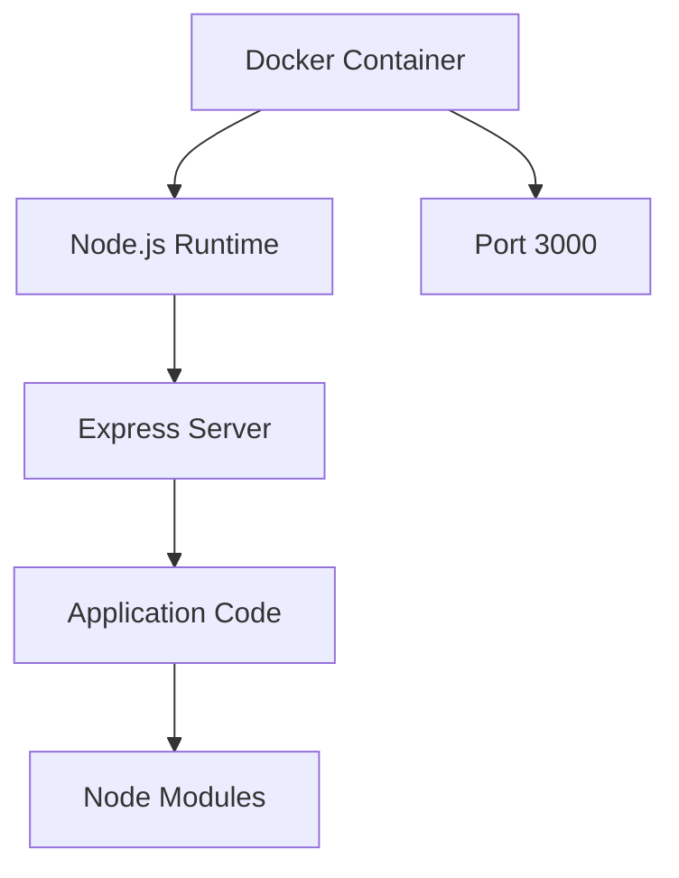
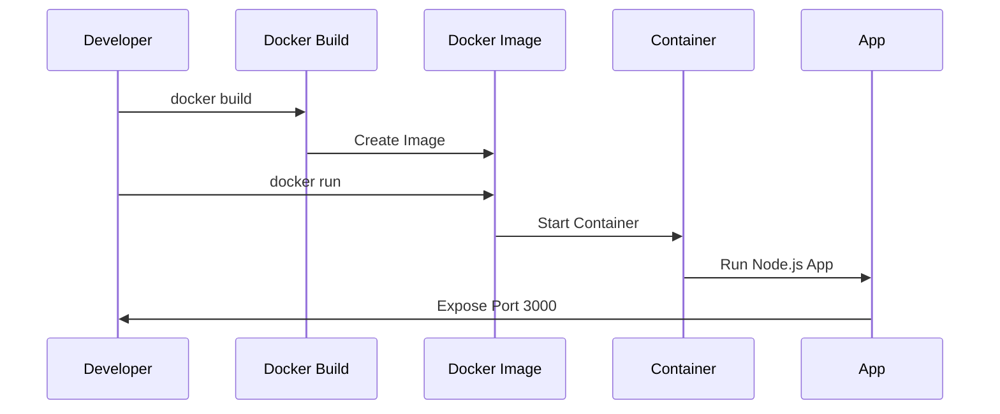

# Docker Setup Documentation

## Container Architecture



## Container Workflow



## Docker Configuration

### Dockerfile Breakdown
```dockerfile
# Base image
FROM node:18

# Set working directory
WORKDIR /app

# Install dependencies first (layer caching)
COPY package*.json ./
RUN npm install

# Copy application code
COPY . .

# Expose port
EXPOSE 3000

# Start command
CMD ["npm", "start"]
```

### .dockerignore Details
Excluded files and directories:
- `node_modules/`: Local dependencies
- `npm-debug.log`: Debug logs
- `Dockerfile`: Build file
- `.dockerignore`: Ignore file
- `.git/`: Version control
- `.gitignore`: Git ignore file

## Running the Application

### Build Commands
```bash
# Build the image
docker build -t mytodolist .

# Run the container
docker run -p 3000:3000 mytodolist
```

### Port Mapping
- Container Port: 3000
- Host Port: 3000
- Access URL: http://localhost:3000

## Best Practices Implemented

1. **Layer Optimization**
   - Dependencies installed separately (Implemented via separate COPY for package.json and npm install)
   - Leverages Docker cache (Achieved by installing dependencies before copying app code)
   - Minimizes rebuild time (Dependencies only reinstalled when package.json changes)

2. **Security**
   - Non-root user context (Inherited from official Node.js image's best practices)
   - Minimal image contents (Implemented via .dockerignore to exclude unnecessary files)
   - Excluded sensitive files (Configured in .dockerignore to exclude .git, logs, etc.)

3. **Resource Management**
   - Single process per container (Implemented via single CMD running npm start)
   - Port explicitly exposed (EXPOSE 3000 in Dockerfile)
   - Clean shutdown handling (Node.js process handles SIGTERM signals)

4. **Development Workflow**
   - Hot-reloading capable (NOT YET IMPLEMENTED - Would require nodemon and volume mounting)
   - Environment variable support (NOT YET IMPLEMENTED - No .env or environment variables configured)
   - Volume mounting possible (NOT YET IMPLEMENTED - Need instructions below)

### Development with Volumes
To enable hot-reloading and development with volumes:

1. Install nodemon:
```bash
npm install --save-dev nodemon
```

2. Add dev script to package.json:
```json
"scripts": {
    "dev": "nodemon server.js"
}
```

3. Update Dockerfile for development:
```dockerfile
# Development stage
FROM node:18

WORKDIR /app

COPY package*.json ./
RUN npm install

EXPOSE 3000

CMD ["npm", "run", "dev"]
```

4. Run container with volume mounting:
```bash
docker run -p 3000:3000 -v $(pwd):/app mytodolist
```

### Environment Variables
To add environment variable support:

1. Create .env file:
```env
PORT=3000
NODE_ENV=development
```

2. Add to .gitignore and .dockerignore:
```
.env
```

3. Install dotenv:
```bash
npm install dotenv
```

4. Update server.js to use environment variables:
```javascript
require('dotenv').config();
const port = process.env.PORT || 3000;
```

## Troubleshooting

### Common Issues
1. Port Conflicts
   ```bash
   # Solution: Use different port
   docker run -p 3001:3000 mytodolist
   ```

2. Build Failures
   - Check Node.js version compatibility
   - Verify package.json integrity
   - Confirm network connectivity

3. Container Access
   - Verify Docker Desktop running
   - Check port mapping
   - Confirm host firewall settings