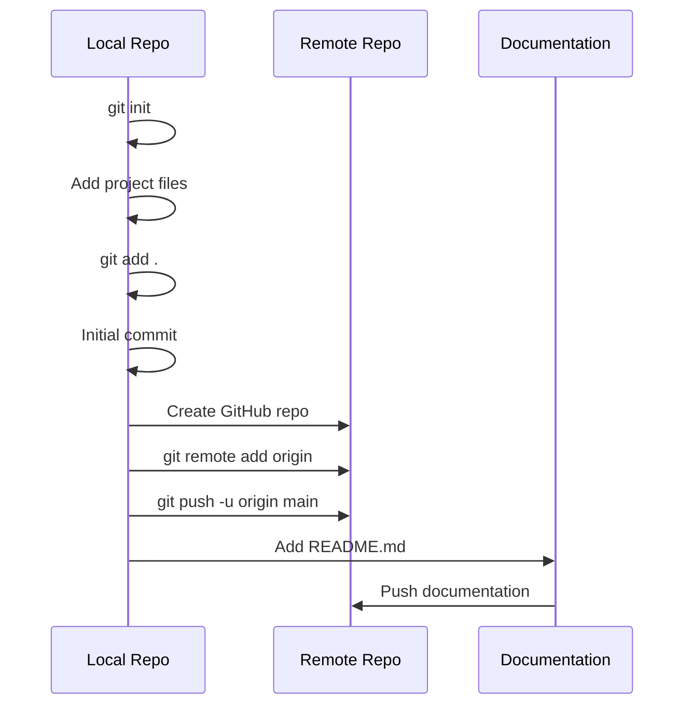
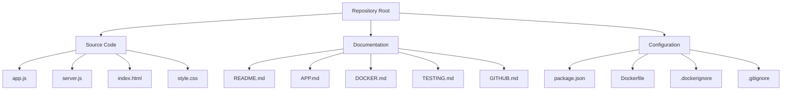
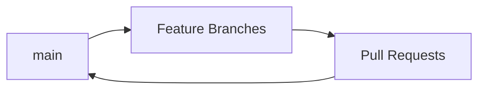

# GitHub Documentation

## Repository Setup Flow



## Steps Taken

1. **Repository Initialization**
   ```bash
   git init
   git add .
   git commit -m "Initial commit: Todo list application with Express backend, Docker support, and comprehensive testing and documentation. Todos stored only in memory in this commit. Documentation done for app, docker and testing including diagrams."
   ```

2. **Remote Repository Setup**
   ```bash
   git remote add origin https://github.com/rahul101001000/mytodolist.git
   git push -u origin main
   ```

3. **Documentation Updates**
   ```bash
   # Add README and push
   git add README.md
   git commit -m "docs: Added comprehensive README with project structure and documentation pointers"
   git push origin main
   ```

## Project Structure in GitHub



## Git Concepts Used

### 1. Basic Commands
- `git init`: Initialize repository
- `git add`: Stage files
- `git commit`: Create commit
- `git push`: Upload to remote
- `git remote`: Manage remotes

### 2. Best Practices Implemented

#### Commit Messages
- Structured format with type and description
- Types used:
  - feat: New features
  - docs: Documentation changes
  - fix: Bug fixes
  - chore: Maintenance

Example:
```bash
docs: Added comprehensive README with project structure and documentation pointers
```

#### .gitignore Configuration
```gitignore
node_modules/
.env
npm-debug.log
build/
dist/
.DS_Store
```

### 3. Documentation Strategy
1. **README.md**
   - Project overview
   - Quick start guide
   - File structure
   - Links to detailed docs

2. **Specialized Docs**
   - APP.md: Architecture
   - DOCKER.md: Container setup
   - TESTING.md: Test strategy
   - GITHUB.md: Git workflow

## GitHub Features Used

### 1. Repository Management
- Public repository creation
- Remote origin setup
- Main branch setup

### 2. Branch Strategy


### 3. Repository Structure
- Root-level documentation
- Clear file organization
- Configuration at root level
- Source code separation

## Common Tasks

### Adding New Features
```bash
git checkout -b feature-name
# Make changes
git add .
git commit -m "feat: Add new feature"
git push origin feature-name
# Create Pull Request
```

### Updating Documentation
```bash
# Direct to main for docs
git add *.md
git commit -m "docs: Update documentation"
git push origin main
```

### Fixing Issues
```bash
git checkout -b fix-issue
# Make fixes
git add .
git commit -m "fix: Resolve issue description"
git push origin fix-issue
# Create Pull Request
```

## Best Practices Checklist

1. **Repository Setup**
   - [x] Clear repository name
   - [x] Appropriate .gitignore
   - [x] Comprehensive README
   - [x] Detailed documentation

2. **Commit Practice**
   - [x] Meaningful commit messages
   - [x] Proper commit types
   - [x] Atomic commits
   - [x] Clear descriptions

3. **Documentation**
   - [x] Installation instructions
   - [x] Usage examples
   - [x] API documentation
   - [x] Architecture diagrams

4. **Code Organization**
   - [x] Logical file structure
   - [x] Clear separation of concerns
   - [x] Configuration management
   - [x] Documentation organization